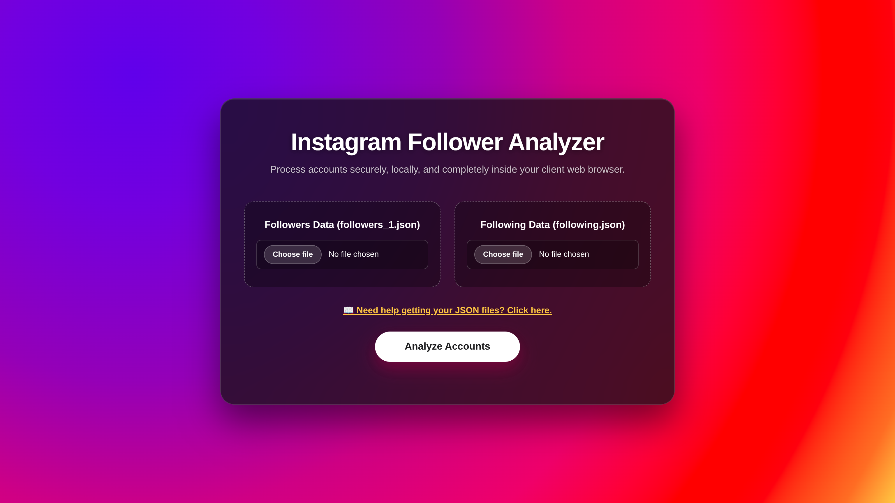

# instagram-follower-analyzer

A clean, responsive, and A modern and privacy-focused Instagram follower analysis tool.Analyse your followers on Instagram. Check out people who do not follow back you all at one go.

---

## 🚀 Live Demo
[Click here to view the Live Project](https://rajitcodez.github.io/instagram-follower-analyzer/)

---

## 📸 Screenshot


---

## ✨ Key Features

- Modern glassmorphism UI
- Fully responsive design
- Local browser-based processing
- Search/filter usernames instantly
- Privacy-friendly (100% client-side)
- No login required
- No API required
- Fast and lightweight

---

## 🗂️ Folder Structure

```
instagram-follower-analyzer/
├── assets/
│   └──screenshot.png
├── index.html
├── style.css
└── script.js
```

---
# 👤 Author
Made with ❤️ by **Rajit Paul** 
